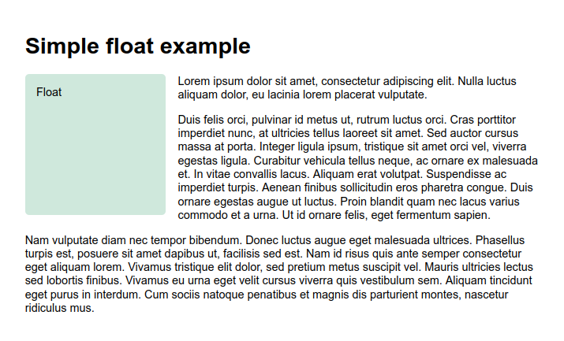

# Diseño CSS

Temas

- Introducción al diseño CSS
- Flujo normal
- Floats
- Posicionamiento
- Flexbox
- Grids

# Introducción al diseño CSS

Las técnicas de diseño de página CSS permiten tomar elementos contenidos en una página web y controlar dónde se colocan en relación con su posición predeterminada en el flujo de diseño normal, los otros elementos a su alrededor, su contenedor principal o la ventana principal. Existen diferentes estrategias para lograr este proposito, se pueden listar las siguientes:

- Flujo normal
  - ¿Cómo se distribuyen los elementos por defecto?
- La propiedad de visualización `display`
- Flexbox
- Grids o Cuadrícula
- Floats o Flotadores
- Posicionamiento
- Diseño de varias columnas

## Flujo normal

El flujo normal es cómo el navegador presenta las páginas HTML de forma predeterminada cuando no hace nada para controlar el diseño de la página.

Los métodos que pueden cambiar la disposición de los elementos en CSS son los siguientes:

- La propiedad [display](https://developer.mozilla.org/en-US/docs/Web/CSS/display)
- La propiedad [float](https://developer.mozilla.org/en-US/docs/Web/CSS/float)
- La propiedad [position](https://developer.mozilla.org/en-US/docs/Web/CSS/position)
- Table layout [display](https://developer.mozilla.org/en-US/docs/Web/CSS/display) Funciones diseñadas para diseñar las partes de una tabla HTML se pueden usar en elementos que no son de tabla usando `display: table`
- Multi-column layout [Multi-column layout](https://developer.mozilla.org/en-US/docs/Web/CSS/CSS_Columns)

> Los elementos de una página web se distribuyen en el flujo normal, si no ha aplicado CSS para cambiar su comportamiento.Comenzar con un documento sólido y bien estructurado que se pueda leer en un flujo normal es la mejor manera de comenzar cualquier página web. Garantiza que su contenido sea legible, incluso si el usuario está utilizando un navegador muy limitado o un dispositivo como un lector de pantalla que lee el contenido de la página. Además, como el flujo normal está diseñado para hacer un documento legible, al comenzar de esta manera, se está trabajando con el documento en lugar de luchar contra él a medida que realiza cambios en el diseño.

### ¿Cómo se distribuyen los elementos por defecto?

De forma predeterminada, el contenido de un elemento de nivel de bloque es el 100% del ancho de su elemento principal y tan alto como su contenido. Los elementos en línea son tan altos como su contenido y tan anchos como su contenido. No puede establecer el ancho o el alto en elementos en línea, simplemente se ubican dentro del contenido de los elementos a nivel de bloque. Si desea controlar el tamaño de un elemento en línea de esta manera, debe configurarlo para que se comporte como un elemento de nivel de bloque con `display: block;` o display: `inline-block;` que mezcla características de ambos.

## Floats

La propiedad `float` se convirtió en una de las herramientas más utilizadas para crear diseños de columnas múltiples en páginas web. Con la llegada de `flexbox` y `grid`, ha vuelto a su propósito original. Originalmente para imágenes flotantes dentro de bloques de texto.

La propiedad `float` se ha utilizado comúnmente para crear diseños de sitios web completos con múltiples columnas de información flotantes para que se coloquen una al lado de la otra (el comportamiento predeterminado sería que las columnas se ubicaran una debajo de la otra, en el mismo orden en que aparecen en la fuente). Hay disponibles técnicas de diseño más nuevas y mejores, por lo que el uso de flotadores de esta manera debe considerarse una técnica heredada.

